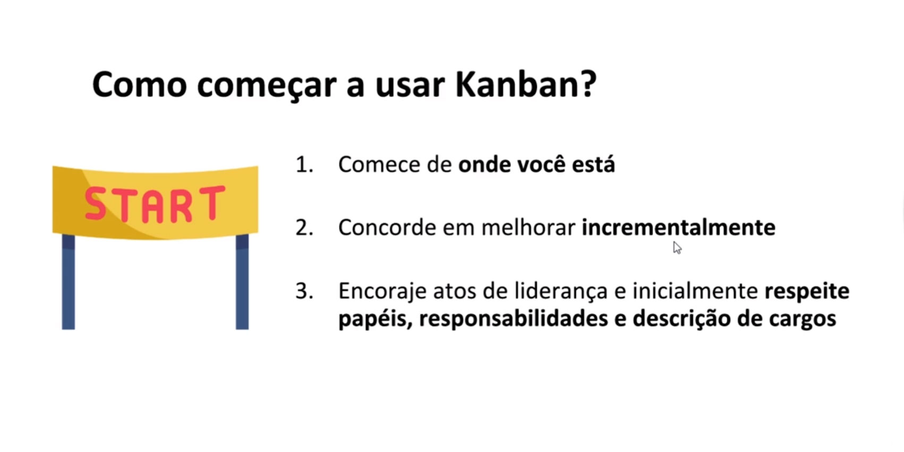

# Definições e Conceitos de Kanban

 

## Introdução

Kanban é um método de entregar valor rápido para o seu cliente através de um fluxo contínuo de entrega.

E hoje em dia a gente precisa sempre entregar valor para o nosso cliente cada vez mais rápido, não é mesmo? Além disso, ele tem a vantagem de poder ser utilizado em várias áreas do conhecimento, não só em T.I.

Ele pode ser utilizado em manufatura, em sistemas de manutenção, em sistemas de operações em geral. Então, independentemente se você trabalha na área de T.I. ou não, é um conhecimento muito válido para você obter.

Você sabia que existem vários significados para a palavra Kanban? Kanban pode significar tudo isso aí. E você hoje vai aprender comigo definitivamente a diferenciar quando as pessoas estão falando: “Kanban, Kanban, Kanban”. E nunca mais vai ter dúvida em relação a isso.

Além do que, eu poderia ressaltar para você as vantagens de aprender Kanban. Uma das grandes vantagens é que ele apresenta menor resistência quando a gente vai implementar se comparado a outras metodologias ágeis, por exemplo, scrum, ou extreme programming, porque ele é mais flexível, tá?

E como eu já disse, ele é adaptável a múltiplas realidades. Ele não é muito fechado, então você pode ir aprendendo conforme você vai implementando e evoluindo, tem essa coisa de estar em contínuo aprendizado.

Além disso, esse estudo ele é para você saber o básico bem feito. Ou seja, aprender o arroz com feijão e saber implementá-lo. 

Visualizar o fluxo de trabalho, você vai aprender a fazer isso. A mapear e gerenciar o fluxo. Vai aprender a escrever um cartão de quadro Kanban. Limitar o trabalho em progresso, isso é muito importante. Talvez seja base, grande, do Kanban.

 

### Vantagens do Kanban

1. **Menor resistência** se comparado com outros métodos ágeis
2. Adaptável a **múltiplas realidades**, times de manutenção
3. **Permite ajustes** conforme outras necessidades são descobertas

 

### Kanban primeiros passos

1. **Visualizar** o fluxo de trabalho
2. **Mapear e gerenciar** o fluxo
3. Os **cartões** do quadro
4. **Limitar** o trabalho em progresso (WIP)
5. Como lidar com **itens urgentes**
6. **Métircas**

 

Como lidar com itens urgentes e algumas métricas. Então, sabendo isso, você vai sair daqui com um exemplo prático que a gente vai utilizar, e vai começar a usar o Kanban hoje, no seu trabalho, na sua vida.

Por que é importante essa coisa do fluxo no Kanban? Eu trouxe esse exemplo: 

 

 

Para você dar uma olhadinha nos carros. Então, o Kanban, ele permite, assim, a gente está olhando figura, que está fluindo bem o trânsito, aí depois começa a ter mais carro e depois engarrafa.

Exatamente isso. Quando a gente “engarrafa”, entrega para o nosso cliente, ele para de receber valor, e o Kanban controla o fluxo para garantir que se cada carro fosse um pouquinho de valor, que os carros continuassem chegando, que o fluxo de valor não engarrafasse. Vamos colocar uma metáfora dessa maneira.

Você também vai aprender a como **evitar os principais erros** que as pessoas cometem ao começar a trabalhar com Kanban, que é **andar contra o fluxo**, como se um carro fosse andar na contramão.

É **ter uma coluna para onroad**,** ou bloqueio**, que é uma coisa que você não pode fazer porque e eu vou explicar por quê. **Não ter esse limite de trabalho em  progresso**, como se a gente pudesse colocar carros indefinitivamente em uma estrada, coisa que a gente não pode, porque você viu que o trânsito para.

E **não mapear todos os itens que estão em progresso de trabalho**. Você vai aprender a não fazer isso e vai aprender por que não pode fazer isso.

 

 

No final desse estudo, você vai sair sabendo fazer um quadro, como no exemplo que eu coloquei e você vai ter tranquilidade de poder explicar isso também para os seus colegas de trabalho.

+ Você será capaz de implementar Kanban **no seu trabalho e na sua casa**
+ Desfrutar **as vantagens** do Kanban e **melhorar processos**.

 

## O que é Kanban

 

 

Como curiosidade, eu trouxe aí o kanji, que são as sílabas japonesas, que significam “kan ban”. Queria trazer um pouco da história do Kanban.

 

 

É um mecanismo que sustenta, é a maneira de gerenciar, tá, que sustenta o sistema de produção Toyota, ele começou aí. Que é o Kaizen, de melhoria contínua. Kaizen significa melhoria contínua. Que é a União do just in time, apenas na hora certa, com um toque humano na automação.

Por que eu trouxe isso para vocês? Porque ele começou, né, na manufatura, na fabricação de carros mesmo, e depois foi adotado no desenvolvimento de software.

Por isso que é interessante a gente ver que ele migrou de uma coisa que é hardware, produzir um carro, para depois na área do conhecimento, do desenvolvimento de conhecimento.

Eu acho importante a gente saber disso porque ele é utilizado em várias indústrias, em várias áreas, e já funcionou para muita gente. Vamos então entender, de uma vez por todas, os Kanbans.

Kanban, se traduzido ao pé da letra para o português, é “cartão de sinal”. Mas a ente se confunde, por quê? O quadro Kanban, o sistema Kanban, também às vezes só é chamado de Kanban.

 

 

Então, temos o sistema puxado, que é o método da Toyota. E depois, o David Anderson, de 2006 a 2008, estudando o sistema Toyota, desenvolveu o método Kanban usando o lean, que são os princípios que a gente vai ver em breve, e por isso começou a utilizar esse método no desenvolvimento de software, e é isso que a gente vai aprender hoje no nosso exemplo.

Por isso que é muito confuso. E para poder confundir um pouquinho mais, ele colocou o nome do livro dele de Kanban. Então por isso que as pessoas misturam muito as coisas, e hoje você já pode sair explicando isso por aí.

Então, qual é a relação entre lean, o pensamento lean, Kanban e modelos ágeis. Você não precisa saber disso para poder aproveitar o curso hoje não. Mas eu acho importante, caso você tenha essa dúvida, para entender quem é quem aqui.

 

 

O pensamento lean, que é um pensamento de melhoria contínua, de eliminar desperdícios, de entregar valor mais rápido para o cliente. Esse pensamento, ele permeia todos esses modelos, ele é maior que todos esses modelos.

E, dentro desse pensamento lean, grande, tem o desenvolvimento de produto lean usando o lindo. E dentro dele também tem o Kanban. O Kanban não é considerado o modelo ágil por muitos autores, tá?

O pensamento lean também está dentro dos modelos ágeis como scrum, XP, Crystal. Mas, por exemplo, scrum não é Kanban, apesar de alguns modelos usarem, tá? Para você entender mais ou menos como que isso está na área do conhecimento. Isso é só para, se alguém te perguntar, você ter um mapeamento melhor. Combinado?

O que é um sistema puxado? Vou dar o exemplo aqui para vocês entenderem bem fácil e bem básico mesmo. O sistema puxado é quando você relaciona um cartão a uma tarefa. Nesse caso, vamos supor que uma pessoa é uma tarefa para cada ingresso do Louvre.

Então, vamos supor que o Louvre comporte por dia 6 mil pessoas. Quando ele atingir 6 mil pessoas, só vai poder entrar mais uma pessoa quando sair uma pessoa. Então, o sistema puxado é isso. Ele só aceita mais trabalho quando algum cartão sair do fluxo de trabalho.

 

 

Então, quando sair uma pessoa do Louvre, aí vão ficar 5999. Aí sim pode puxar mais uma pessoa para dentro. 

Um sistema puxado mal gerenciado, e que talvez você já tenha passado por isso, é quando você está na fila de casa noturna e ela lota, aí você tem que esperar alguém sair para você entrar.

 

 

Exatamente isso. Para poder entrar mais trabalho no sistema, algo tem que sair. Isso é o sistema puxado, de uma maneira muito básica, explicado.

Quais são as diferenças do Kanban para outros modelos ágeis? A principal diferença é o **limite de trabalho em progresso**, que a gente chama de Work in Progress, que você vai aprender comigo aqui.

 

 

A gente limita a quantidade de trabalho que pode estar acontecendo ao mesmo tempo. Como se fosse um limite de pessoas na casa noturna. Para evitar que lote e fique muito apertado, por exemplo. E muito apertado, ninguém se diverte.

Você vai aprender isso em detalhes aqui, por que isso é muito é muito importante. E um benefício muito forte é em relação à **adaptação**. Porque, por exemplo, se você conhece scrum, você sabe que o scrum tem umas regras bem rígidas para poder funcionar. E o Kanban, ele aposta na melhoria contínua.

Então, você está sempre aprendendo e melhorando, aprendendo e melhorando. Ele não é tão rígido assim, ele é muito mais adaptável. Lembra que ele nasceu em uma realidade de indústria de carros e agora está sendo usada na indústria de software? Ele funciona para várias coisas.

Além disso, é importante você saber o seguinte: o que você vai aprender aqui hoje, ele é aplicável para a melhoria de processos. Mas, por exemplo, não serve para tudo. Como a gente fala: Kanban é martelo, mas nem tudo é prego. Entendeu?

Então a gente não está oferecendo aqui uma bala de prata para poder resolver todos os seus problemas, mas ele é útil para muitas coisas. Não vai funcionar, por exemplo, para poder medir termômetro de organização em termos de moral de pessoas. Só que vai servir para muita coisa em relação a processos e melhorias.

 

 

Por que você vai começar com Kanban? Fluxo contínuo, e melhor agilidade em relação a entregar valor mais rápido. Esse é o grande valor do Kanban: entregar valor mais rápido ao seu cliente. E isso vai tornar você mais competitivo.

Mudança evolutiva gera menor resistência. Melhor previsibilidade. Por quê? Uma vez que você tem pequenas tarefas sendo puxadas nesse fluxo mais rapidamente, você tem feedback mais rápido. Então você pode ter uma previsão mais rápida de quando você vai entender.

E isso, além de acalmar o seu cliente, você pode também ter feedback mais rápido se você está entregando que o cliente quer, e evita que você produza algo que o cliente não quer.

Melhor gerenciamento de risco. Por quê? Quando você está entregando pequenininho, se você está indo para o lugar errado e você descobre logo, evitar gastar dinheiro na coisa errada. E isso evita risco em geral. Você não comete um erro tão grande.

 

 

“Comece de onde você está”. O Kanban, não é um processo em si, ele é aplicado sobre um processo. Então você já tem esse processo. Simples que seja, complicado que seja, você já tem um processo.

Você vai aplicar o Kanban sobre esse processo, para entender como é que ele está funcionando. Então você não precisa criar nada novo, você começa de onde você está, de onde você está agora dá para começar o Kanban. É muito legal por isso. É simples também.

E vamos concordar que o ótimo é inimigo do bom, a gente não precisa ter o modelo Kanban mais perfeito de início. A gente vai melhorando passo a passo. Pequenos passinhos.

Além disso, por que ele é bom em relação à resistência das pessoas? Porque a gente não muda nada no começo, não muda cargo, não tem nome. Sane? Todo mundo continua de onde está. E isso evita que as pessoas tenham medo, por exemplo, de perder o emprego, se você está aplicando isso na sua organização.

Isso é uma coisa excelente. Vamos aqui, então, falar do nosso caso prático. Leia o caso prático da Fitfast, que é um aplicativo onde você é o desenvolvedor e foi lá me conhecer e vai trazer minha consultoria, vamos trabalhar juntos, para poder ensinar o time da Fitfast a implementar Kanban na realidade deles.

 

## O caso do app FitFast 

Você é parte de um grupo de desenvolvimento de software e foi a uma palestra de Kanban para poder entender como poderia se beneficiar desta técnica no seu trabalho. Você assistiu a palestra, gostou muito dos conceitos e no final foi conversar com os palestrantes. Carol Azevedo é uma delas. Você pede ajuda da Carol para poder implementar Kanban na prática no seu grupo de trabalho. Vocês agendam uma dia para a consultoria.

A empresa onde você trabalha atende um cliente de um aplicativo de receitas de comida para internet chamado Fitfast. Você é desenvolvedor, seu grupo tem um testador (João), um gerente de produto (Carlos), um gerente de TI (Patrick), uma analista de requisitos (Débora) e mais uma outra desenvolvedora (Camila).

As principais reclamações que vocês escutam do cliente vem através do gerente de produto, chamado Carlos. Ele entende muito de código e sempre defende o grupo, mas às vezes muda a prioridade do trabalho no meio do desenvolvimento. O grupo todo se sente frequentemente atolado e sem direção. Na primeira reunião com a Carol o grupo apontou os seguintes desafios.

+ Nós frequentemente entregamos fora do prazo
+ Nossas estimativas frequentemente estão erradas
+ Nosso time está atolado de trabalho
+ As prioridades não estão claras
+ O trabalho chega ao time por várias fontes
+ Não sabemos quem está fazendo o que

Nesta primeira reunião a Carol vai ajudar o seu grupo a entender como o Kanban pode ser utilizado para poder ajudar nestes pontos.

 

## [Exercício] Vantagens do Kanban

Selecione a opção que contém as principais vantagens do Kanban:

- [x] A) Fluxo contínuo, melhor agilidade
         Mudança evolutiva, menor resistência
         Melhor previsibilidade
         Controle das variáveis
         Ritmo contínuo
         Melhor gerenciamento de risco
  > Correta. Estas são as principais vantagens do Kanban.

- [ ] B) O principal limite é o WIP que indica quando o trabalho pode andar 
É mais aberto quanto a adaptação, quanto mais o time aprende mais pode adaptar o quadro a sua realidade.
  > Incorreta. Esta são as principais diferenças em relação a outros modelos ágeis.

- [ ] C) A principal vantagem foi ter sido implementado pela equipe de manutenção de software da Microsoft XIT Sustained Engineering em 2004.
  > Incorreta. Esta foi a primeira vez que ele foi implementado no desenvolvimento de software.

- [ ] D) Vem do Sistema de Produção Toyota, “os dois pilares do Sistema de Produção Toyota são just-in-time e automação com um toque humano, ou autonomação". A ferramenta usada para operar o sistema é kanban.
  > Incorreta. Esta é a origem do Sistema kanban.

 

## [Nota] Sistema Toyota de Produção - Lean I 

https://www.youtube.com/watch?v=c6KVeDbgRgU

Se você quiser saber apenas sobre **just in time** e **sistema kanban**  assista apenas este vídeo parte II. 

Sistema Toyota de Produção - Lean II

https://www.youtube.com/watch?v=6vmdVR9dzPM

