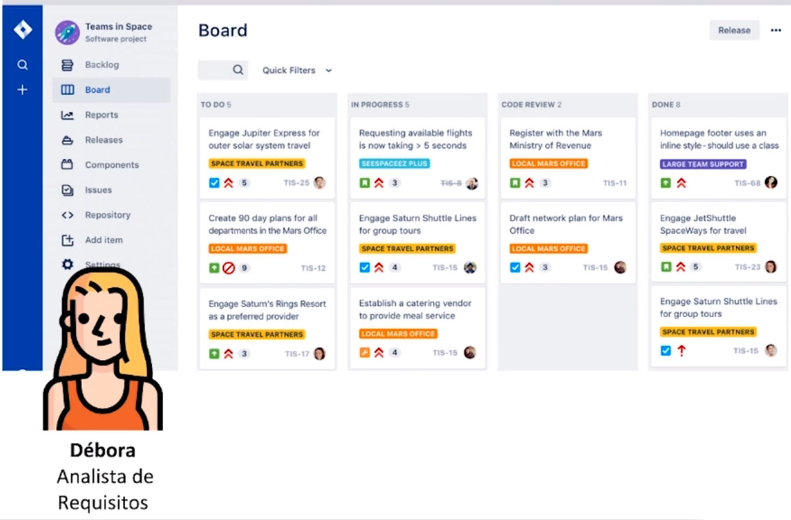
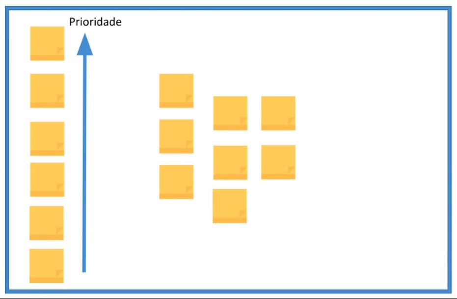
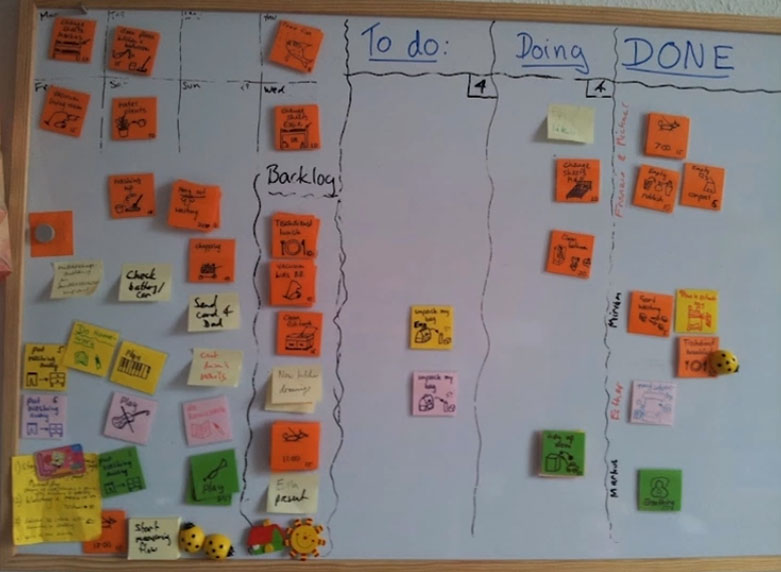

# Montando um Quadro Kanban

 

## Visualizar o Fluxo de Trabalho

Lemos o caso do aplicativo da Fitfast, e agora a gente vai conhecer o time. 

 

 

Temos a Camila, o Carlos, a Débora, o João e o Patrick, que estão juntos aqui comigo e com você para a gente começar a ajudar esse time que está desenvolvendo um aplicativo.

Então, quais são os principais desafios? Quais são as queixas, as dores? O time disse para mim que as prioridades não estão claras para eles, eles não sabem quem está fazendo o que, então às vezes tem retrabalho.

Eles **frequentemente entregam fora do prazo**, as **estimativas deles não estão claras**, o time está cheio de trabalho, sempre sentindo, assim, **muito sobrecarregado**. E o trabalho chega de diversas fontes.

Então tem muita gente **pedindo coisas no corredor**, e aí tem o sistema formal, mas muita gente interrompendo. Então eles têm essas queixas, que eles esperam que, usando o Kanban, que isso seja diminuído. 

A primeira pergunta que eu faço, e nesse caso é a Débora que vai responder, é como que ele sabem em que eles estão trabalhando. Temos um exemplo de um quadro de jira, que é uma das ferramentas onde vocês podem depois usar virtualmente o Kanban. 

 

 

Muito bem. Aí eu peço para ela me mostrar e estamos olhando juntos aqui o Jira. E a Débora analisa requisitos, ou seja, ela vai olhando o que o time tem que fazer e vai documentando isso no Jira, e ela está contando isso pra gente, que é assim que funciona.

Aí eu faço o seguinte: eu uso um quadro branco lá, vamos pedir um, e fala assim: “Vamos visualizar, então, o que vocês estão fazendo? Pega do que está no Jira e vamos colocar no post-it”. Aí eu distribuo um monte de post-it e falo: “Escreve em caneta. Não caneta BIC, caneta grossa, para a gente poder visualizar de longe”. Isso é uma dica boa para você.

E aí eu peço para o Patrick, o Carlos e a Débora. Vamos lá, coloca aí o que vocês estão fazendo agora, meio que transcreve o Jira para mim e coloca em ordem de prioridade. O que é mais importante em cima e o que é menos embaixo.

 

 

Eles vão lá e escrevem para mim. Está tudo aí? Está tudo aí no Jira, está beleza, documentado. Só que o acontece? Quando eu pergunto: “O que está no quadro?”, e vocês colocaram, reflete toda a realidade? Você, o João e a Camila não ficam muito confortáveis, falam: “Não sei. Acho que está faltando coisa”. Eu falo: “Gente, agora é a hora da verdade. Vamos lá e vamos colocar as cartas na mesa. Me digam o que está faltando”. Vocês pegam e escrevem esses post-its para mim.

Então, nem tudo que estava no Jira é a realidade, ou seja, está faltando coisa no gira. Esse é o grande problema das ferramentas eletrônicas, eu queria tratar isso com vocês, que é o que o Alistair Cockburn chama de “Information Refrigerator”, ou seja, ele congela a informação.

Primeiro: a informação não está acessível a todo mundo. Você precisa ter acesso ao mural lá do Jira, onboard para você poder entrar e ver. Você depende de dominar um software, o Jira é um aplicativo que você tem que usar. Você precisa saber usar.

E, como aconteceu nesse caso aqui, às vezes a informação fica desatualizada. Tem que ter uma pessoa olhando. E facilmente fica desatualizada como no caso aqui do seu time, da Fitfast, porque tem pedidos vindos de outras fontes, e aí como é a Débora que está controlando, o que está acontecendo aqui é que esses pedidos não estão sendo documentários.

Então, existem algumas saídas se você quiser usar ferramentas eletrônicas. Mas o que tem que acontecer é que o seu quadro virtual tem que estar real, ou seja, ele tem que estar projetado o tempo todo.

Eu coloquei dois exemplos no quadro. Existem quadros de verdade, que dá para você escrever, são caríssimos. Mas se você quer investir, vai na fé e faça isso.

 

 

E você pode também comprar uma supertelevisão que ela seja dedicada a estar projetando o quadro o tempo todo, porque precisa estar visível que é o que a gente chama de “Information Radiador”, que está radiando, está quente. Ao contrário do refrigerator.

Tem que estar quente. Todo mundo que passa, a informação bate na cara. Para evitar esse tipo de situação que a gente acabou de vivenciar. O que a Carol recomenda é que a gente comece no hardware mesmo, que a gente comece no papel.

 

 

Porque evita esse problema de ter que aprender, usar o papel, é mais barato, mais rápido. Então, se você for começar hoje a usar Kanban, começa no papel, compra um quadro branco. Vamos no bê-á-bá que vai ser mais bacana.

O que a gente aprendeu, então, hoje, que é o básico para você começar hoje. As vantagens de visualizar o **fluxo de trabalho**, vai lá e escreve o que você está fazendo hoje. Faço isso, faço isso, faço isso. Escreve, inclusive, o que em teoria você não deveria estar fazendo. Combinado?

Qual é a vantagem disso quando você escreve? O que está escondido aparece, como aconteceu no nosso caso aqui, que você está me ajudando a resumir.

E todo mundo que é interessado naquele trabalho, começa a ver o trabalho também. Então você não precisa fazer tanto status report, se o gerente de T.I. passar, ele dá uma olhada e vê o que está acontecendo. Além disso, você vê quem está fazendo o quê. Em breve você vai ver como. O que você está fazendo, tem um panorama do trabalho, e a quantidade de trabalho em que o time está envolvido.

Então, visualizar o fluxo de trabalho tem essas vantagens, que são enormes.

**Visualizar o fluxo de trabalho**

**Vantagens**

+ Ajuda você a ver: 
  + **Quem** está fazendo o que 
  + **O que** você está fazendo
  + **A quantidade** de trabalho em que o time está envolvido

 

## [Exercício] Visualizando o trabalho

O que você recomendaria a um time que está desejando começar a usar Kanban?

- [ ] A) Reunir o grupo e pedir para que falem sobre o que estão trabalhando.
  > Incorreta. Falar apenas não vai tornar possível mapear as atividades em que estão trabalhando.

- [ ] B) Reunir o grupo e fazer uma sessão de Brainstorming onde todos podem falar livremente dando sugestões.
  > Incorreta. Sessões de brainstorming são úteis para equipes mas não para quando estão iniciar a usar Kanban.

- [x] C) Reunir o grupo e pedir que anotem em pedaços de papel, cada atividade em que estão trabalhando e colocam os papéis em um mural para que todos possam ver.
  > Correta. A primeira etapa ao adotar Kanban é visualizar o trabalho de forma simples.

- [ ] D) Reunir o grupo e pedir que eles incluam em uma ferramenta eletrônica cada atividade em que estão trabalhando.
  > Incorreta. Ao iniciar o uso de Kanban ferramentas eletrônicas em um primeiro momento podem ser uma barreira.

 

## [Exercício] Ferramentas eletrônicas

Quais são as suas recomendações caso o seu time opte por utilizar o quadro Kanban em ferramentas eletrônicas?

- [ ] A) Garantir que o gerente possa inspecionar se o time está usando com regularidade a ferramenta assim o método Kanban poderá funcionar regularmente.
  > Incorreta. Os times Kanban maduros são autorregulados e não existe esta necessidade de inspeção de gerente. Isso é contra a filosofia de melhoria contínua que deve emergir de dentro do time.

- [ ] B) Ter um expert na ferramenta que seja responsável por mantê-la atualizada, adicione os cartões, e garanta que todos passem as atividades a ele.
  > Incorreta. No Kanban todos são responsáveis pelo quadro e o trabalho não deve ser centralizado em um único responsável.

- [ ] C) Garantir que a ferramenta tenha muitas funcionalidades assim seu time poderá adicionar muitos detalhes em cada cartão, inclusive adicionando linhas de código por exemplo.
  > Incorreta. As ferramentas melhores são as que são simples de usar e não necessariamente as que possuem muitas funcionalidades.

- [x] D) Garantir que a ferramenta possa ser conectada a alguma TV ou board visual para que o quadro esteja sempre disponível e visível para todo o time, que ela seja fácil de ser aprendida, intuitiva e que a maior parte do time esteja envolvida na escolha da ferramenta.
  > Correta. Ferramentas eletrônicas possuem vantagens e desvantagens e para garantir que elas funcionem é preciso garantir que quadro Kanban esteja 100% do tempo visível para todo o time.