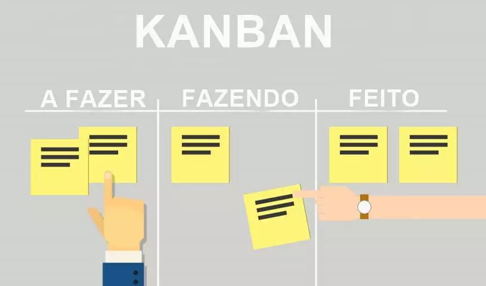

 
 

 ### Repositório criado para documentação de estudos em Kanban
  

 

### 📰 Posts

+ [O que é kanban e como ele pode ajudar na organização do trabalho](https://blog.runrun.it/o-que-e-kanban/)
+ [Método Kanban: um guia (quase) completo](https://targetteal.com/pt/blog/metodo-kanban/)

 

### 🎙️ Podcasts

+ [Kanban e o fluxo de trabalho Hipsters #74](https://cursos.alura.com.br/hipsterstech-kanban-e-o-fluxo-de-trabalho-hipsters-74-a512)

 

### 📚 Livros
 
+ Kanban: Mudanca Evolucionaria de Sucesso Para Seu Negocio de Tecnologia - Donald G. Reinertsen 