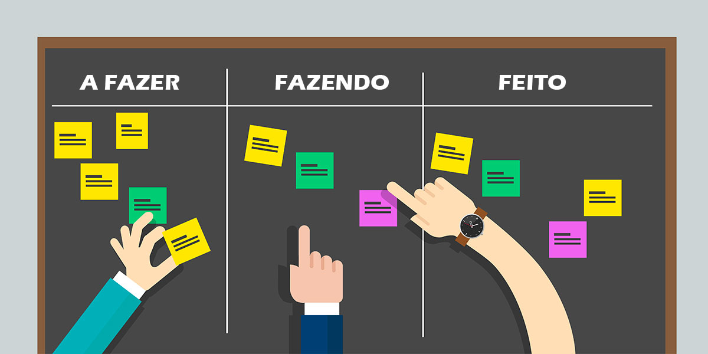

 
 

 ### Repositório criado para documentação de estudos em Kanban
  

 

### 📰 Posts | Artigos

+ [O que é kanban e como ele pode ajudar na organização do trabalho | **Runrun.it**](https://blog.runrun.it/o-que-e-kanban/)
+ [Método Kanban: um guia (quase) completo | **Target Teal**](https://targetteal.com/pt/blog/metodo-kanban/)
+ [kanban - Como a metodologia Kanban é aplicada ao desenvolvimento de software | **Atlassian Agile Coach**](https://www.atlassian.com/br/agile)
+ [Método Kanban: Guia detalhado e 5 modelos prontos para usar | **Blog Trello**](https://blog.trello.com/br/metodo-kanban)
+ [Kanban - O que é e TUDO sobre como gerenciar fluxos de trabalho | **Artia**](https://artia.com/kanban/)
+ [Confira 7 dicas para dominar o Kanban na agência! | **Rock Content - Clips**](https://rockcontent.com/br/blog/dicas-para-kanban/)
+ [Kanban: O que é, como funciona e como implantar esse método | **Egestor**](https://blog.egestor.com.br/kanban/)
+ [Kanban: o que é e quais seus benefícios | **Omie**](https://blog.omie.com.br/blog/kanban-o-que-e-e-quais-seus-baneficios)
+ [Kanban: o que é, como funciona o sistema e como aplicar o método | **Nomus**](https://www.nomus.com.br/blog-industrial/kanban/)

 

### 🎙️ Podcasts

+ [Kanban e o fluxo de trabalho | **Hipsters #74**](https://hipsters.tech/kanban-e-o-fluxo-de-trabalho-hipsters-74/)
+ [Nossos erros com Kanban | Love the Problem / K21](https://www.youtube.com/watch?v=Aad_LK2MmCE)

 

### 📚 Livros
 
+ [Kanban: Mudanca Evolucionaria de Sucesso Para Seu Negocio de Tecnologia - **David J. Anderson, Donald G. Reinertsen**](https://amzn.to/3E30XSZ) | [Versão Kindle](https://amzn.to/3CkBWBg)

 

### 🛠️ Ferramentas

+ [Trello](https://trello.com/pt-BR)
+ [Jira Software](https://www.atlassian.com/software/jira)]
+ [Asana](https://asana.com/pt/uses/kanban-boards)
